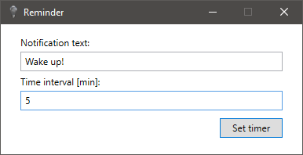
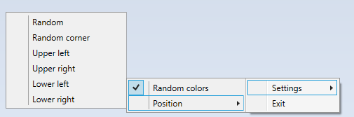

# Tray Timer
Tray Timer is a simple customizable notifications app that works in Windows tray. This WPF app will remind you to take a break or work with your habits.

## How to install?
[Here is an installer.](./artifacts/TrayTimer.Setup.msi)

## Screenshots:
### Main application windows:

 

### Settings view:

 

## Technologies used:
- WPF
- MVVM pattern
- [Hardcodet WPF NotifyIcon](http://www.hardcodet.net/wpf-notifyicon)